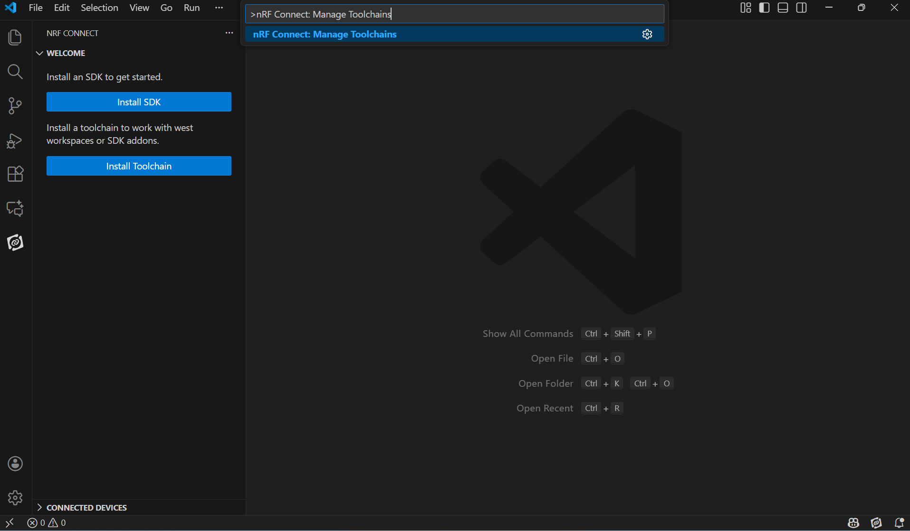
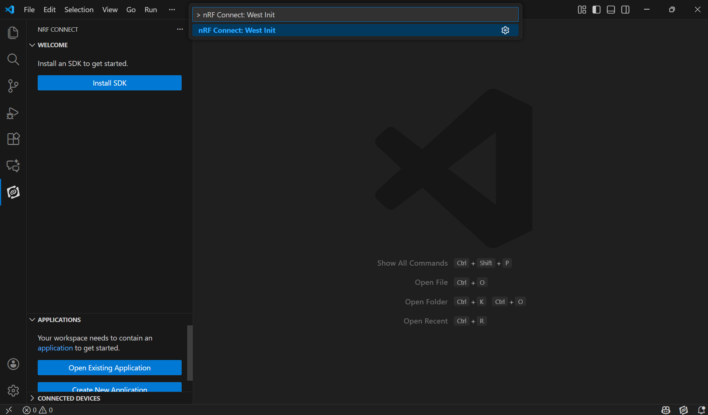
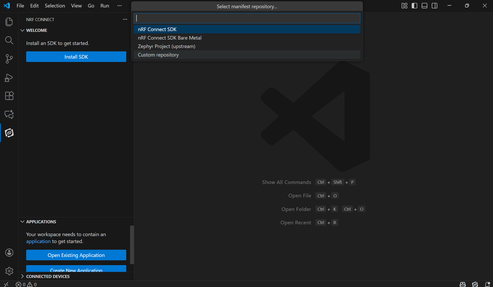
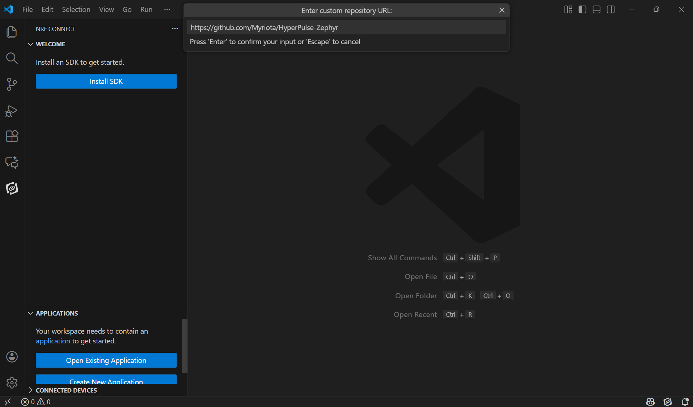
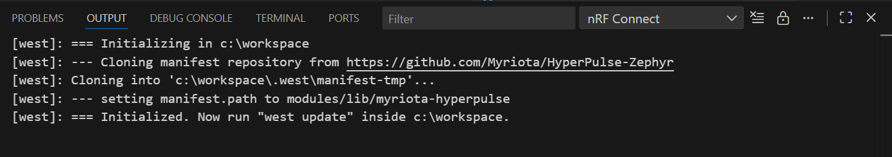
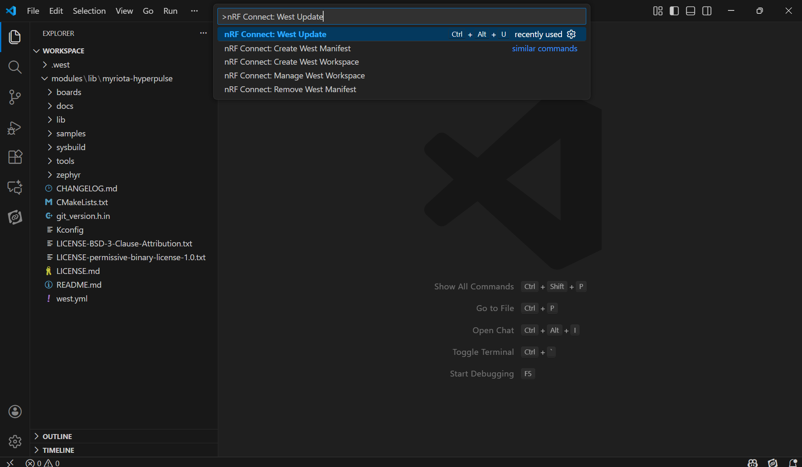
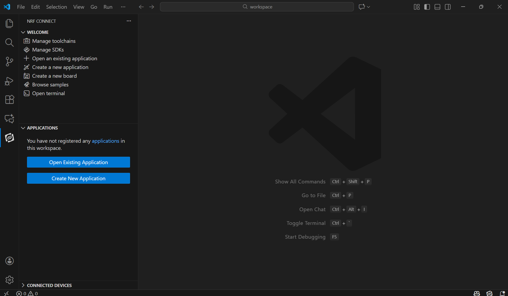
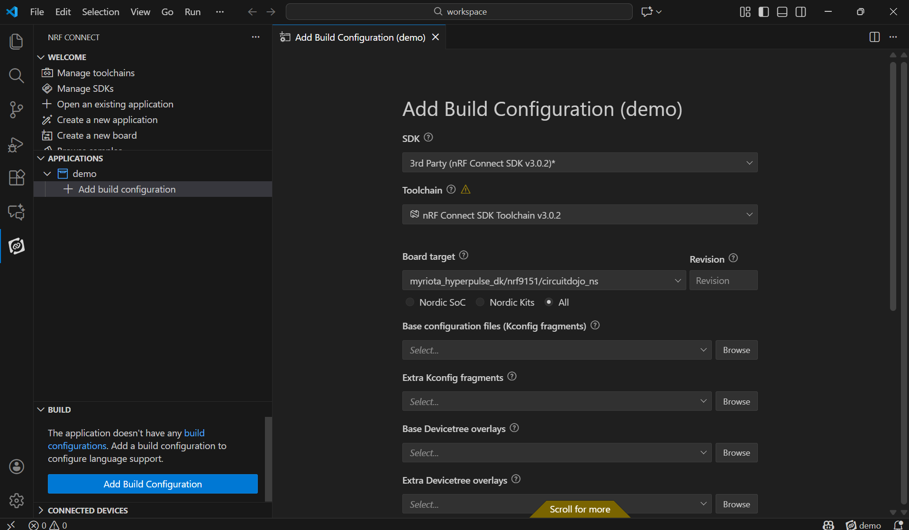
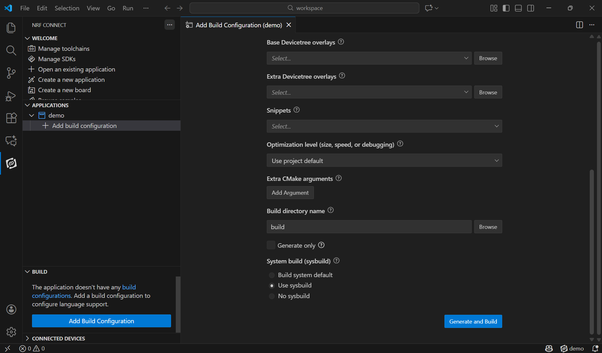
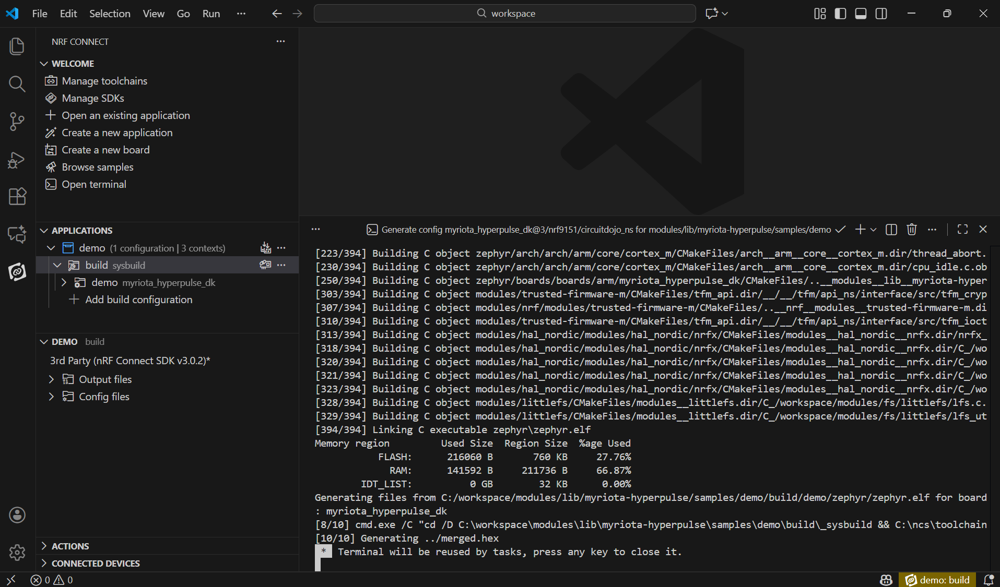

# Myriota HyperPulse™ Zephyr Module 
[](https://myriota.github.io/HyperPulse-Library-Docs/)

The Myriota HyperPulse™ Module provides the software solution for enabling IoT connectivity over Myriota's Non-Terrestrial Network(NTN).
It provides users with necessary source files and artifacts to integrate into their applications. The module comes
bundled with sample applications and reference documentation for accelerated product development.

> [!TIP]
> 📚 **Documentation Site** 
> Myriota HyperPulse™ API reference and AT command manual:  
> https://myriota.github.io/HyperPulse-Library-Docs/

> [!NOTE]
> Currently, this module supports Nordic Semiconductor nRF9151 SoC only.


### Setup For Local Installation

There are different ways to setup the HyperPulse Zephyr module, depending on your preferred development environment.
1. [Using Visual Studio Code and the nRF Connect for VS Code extension](#nrf-connect-for-visual-studio-code)
2. [Using command line and nRF Util](#command-line-and-nrf-util)

---

## nRF Connect for Visual Studio Code

### 1. Setup

1.1. Install [nRF Connect for VS Code](https://www.nordicsemi.com/Products/Development-tools/nRF-Connect-for-VS-Code)

1.2. Once the extension pack is installed. Install the `3.0.2` Toolchain.

From the command palette, use the `nRF connect : Manage Tooolchains` command to install the required toolchain version.

> [!TIP]
> You can invoke the command palette by pressing `Ctrl+Shift+P`



1.3. Run the `nRF Connect: West Init` command using the command palette.



1.4. Follow the prompts to set the location for the west manifest file. Then when
prompted for a project type, use the `Custom repository` option.

> [!IMPORTANT]
> For Windows Users: As the operating system doesn’t handle long file paths well,
> ensure the workspace dir is short and close to the root `C:\` dir.
> For example `C:\workspace` is used in this guide.



1.5. When prompted for the URL, enter `https://github.com/Myriota/HyperPulse-Zephyr`,
and select the latest version available.



When ready, you will see the below output in the VS Code terminal:



> [!IMPORTANT]
> In VS Code, you may have to open the folder you created during the west init step
> before running the west update command in tne next step.

1.6. Once initialised, run the `nRF Connect: West Update` command.



> [!NOTE]
> This process will download a full copy of Zephyr and NCS, which is required for any project
> that uses a west manifest file. It will take some time to download all the dependencies.

### 2. Building Applications

2.1. Click the `Open Existing Application` button from the Applications tab and choose,
for example, the  `modules/lib/myriota-hyperpulse/samples/demo` folder.



2.2. Then click the `Add Build Configuration` button.



2.3. Select the target board

  The supported board targets for the HyperPulse-Zephyr module are:
  1. myriota_hyperpulse_dk/nrf9151/circuitdojo_ns
  2. nrf9151dk/nrf9151/ns

> [!TIP]
> It is recommended to set the build directory as `build/<board>`.

2.4. Please ensure the `Use sysbuild` checkbox is checked.



2.5. Click `Generate and Build` to initiate the build process.



Once you get the above output, you're good to go!

### 3. Programming Devices

we're working on ways to flash from the UI in VSCode.
In the meantime, please follow the [command line instructions](#7-programming-devices)

### 4. Network Information

we're working on ways to generate and flash Network Information from the UI in VSCode.
In the meantime, please follow the [command line instructions](#8-network-information)

---

## Command Line and nRF Util

### 1. Install nrfutil

  Download the nRF Util tool from [Nordic Semiconductor](https://www.nordicsemi.com/Products/Development-tools/nRF-Util/Download#infotabs)

> [!TIP]
> For Linux: issue the command `sudo mv nrfutil /usr/local/bin; chmod +x /usr/local/bin/nrfutil` to install nRF Util.

### 2. Install nRF Connect SDK and Toolchain

  Supported NCS version(s):
  - v3.0.2

  Follow the version-specific installation instructions here: [Install NCS v3.0.2](https://docs.nordicsemi.com/bundle/ncs-3.0.2/page/nrf/installation/install_ncs.html)

### 3. Generate Environment Variables:

  Linux/macOS:
  ```
  mkdir <ncs_base_dir>/env
  nrfutil toolchain-manager install --ncs-version v3.0.2
  nrfutil toolchain-manager env --as-script sh > <ncs_base_dir>/env/ncs_3.0.2.sh
  ```

  Windows:
  ```
  mkdir <ncs_base_dir>\env
  nrfutil toolchain-manager install --ncs-version v3.0.2
  nrfutil toolchain-manager env --as-script cmd > <ncs_base_dir>\env\ncs_3.0.2.cmd
  ```

### 4. Adding the HyperPulse Module:

  ```
  cd <ncs_base_dir>/v3.0.2
  git clone git@github.com:Myriota/HyperPulse-Zephyr.git modules/lib/myriota-hyperpulse
  source ~/<ncs_base_dir>/env/ncs_3.0.2.sh
  west config manifest.path modules/lib/myriota-hyperpulse
  west update
  ```

### 5. Using the HyperPulse Module:

Refer to sample applications provided with this module to speed up your app development.
1. [Demo Application](./samples/demo/README.md)
2. [AT Modem Application](./samples/at_modem/README.md)


### 6. Building Applications

#### Setup Environment
Either run the build inside the virtual environment from `nrfutil toolchain-manager`, or source the two env scripts

Linux/macOS:
```
source <ncs_base_dir>/env/ncs_3.0.2.sh
source <ncs_base_dir>/v3.0.2/zephyr/zephyr-env.sh
```

Windows:
```
<ncs_base_dir>\env\ncs_3.0.2.cmd
<ncs_base_dir>\v3.0.2\zephyr\zephyr-env.cmd
```


#### Supported Target Boards
Below is a list of supported target boards tested as working and supported by the Myriota HyperPulse™ Module

1. nRF9151 DK (target name: `nrf9151dk/nrf9151/ns`)
2. Myriota HyperPulse DK (target name:`myriota_hyperpulse_dk/nrf9151/circuitdojo_ns`)


#### Build command
```
west build --build-dir <build_dir> <application_dir> --board <board_string> --sysbuild --pristine
```

For example to build the demo application for the HyperPulse Developer Kit (Circuit Dojo):
```
cd <hyperpulse_zephyr_repo_root>
west build --build-dir samples/demo/build samples/demo --board myriota_hyperpulse_dk/nrf9151/circuitdojo_ns --sysbuild --pristine
```

### 7. Programming Devices

For the nRF9151DK board, Nordic Semi's nRF Util tool is recommended.

> [!TIP]
> Run `nrfutil install device` to enable the firmware programming feature.

For the HyperPulse DK (Circuit Dojo), PyOCD tool is required. Install following dependencies for PyOCD

For Mac you'll need to install libusb using brew:

  macOS:
  ```
  brew install libusb

  ```

  Linux/macOS:
  ```
  python -m venv .venv
  source .venv/bin/activate
  python3 -m pip install -U pyocd
  ```

  Windows Cmd Prompt:
  ```
  python -m venv .venv
  .venv\Scripts\activate
  python -m pip install -U pyocd
  ```

#### Programming Commands
1. nRF9151DK Board:
```
nrfutil device program --firmware <file_to_program>
```

For example:
```
nrfutil device program --firmware build/merged.hex
```

2. HyperPulse Developer Kit (Circuit Dojo)

```
pyocd load --target nRF91 merged.hex
pyocd cmd --target nRF91 --command 'reset'
```

### 8. Network Information

Network information is required for Myriota HyperPulse™ supported devices to correctly attach to the Myriota HyperPulse™ Network.
The Network information is supplied as a `HEX` file and must be be programmed onto the device.

#### Generating Network Information

Use the `network_info.pyz` tool provided in the repository to generate the network HEX file.

```
cd <hyperpulse_zephyr_repo_root>
python ./tools/network_info.pyz \
    --partitions-file <path_to_build_partitions.yml> \
    --partition-name hyperpulse_storage_network \
    -o <output_file_path>
```

- example
```
python ./tools/network_info.pyz \
    --partitions-file samples/demo/build/partitions.yml \
    --partition-name hyperpulse_storage_network \
    -o ./network_info.hex
```

* `--partitions-file`: Path to the partitions.yml file from your build.
* `--partition-name`: Name of the HyperPulse network storage partition.
* `-o`: Path where the generated network HEX file will be saved.

> [!TIP]
> Ensure the partitions file is from the same build as your application firmware to avoid mismatched memory layout.

> [!IMPORTANT]
> The network information will need to be reloaded onto the device
> if the application was programmed using `nrfutil device program --firmware <path_to_fw> --recover`,
> or the command `pyocd erase -t nrf9151 --chip` was issued.

#### Programming Network Information

1. nRF9151DK Board
```
nrfutil device program --options chip_erase_mode=ERASE_RANGES_TOUCHED_BY_FIRMWARE --firmware <network_information_file>
nrfutil device reset
```

2. HyperPulse Developer Kit (Circuit Dojo)

```
pyocd load --target nRF91 <path to network_info.hex>
pyocd cmd --target nRF91 --command 'reset'
```

#### Merge Application and Network Information

The HyperPulse build system supports an optional feature that automatically merges
the built application firmware with dynamically generated network information.
This ensures that the latest HyperPulse network storage information is packaged
directly into a single merged `.hex` file for flashing.

#### Overview

When enabled, the build system will:
- Locate the `hyperpulse_storage_network` partition dynamically.
- Generate a `network_info.hex` file sized and positioned for that partition.
- Merge it with the application firmware into `app_and_network_info_merged.hex` for flashing.

#### How to Enable

Edit sysbuild.conf in the application directory

```
SB_CONFIG_HYPERPULSE_MERGE_APP_AND_NETWORK_INFO=y
```

> [!NOTE]
> The build has this feature disabled by default

> [!IMPORTANT]
> Enabling this setting is recommended for quick deployment and testing only.
> Do not enable this setting for production firmware.
> It is recommended to generate and program the latest network information.

#### Programming Merged Application and Network Information

1. nRF9151DK Board
```
nrfutil device program --firmware <path to app_and_network_info_merged.hex> --recover
nrfutil device reset
```


2. HyperPulse Developer Kit (Circuit Dojo)

```
pyocd erase --chip -t nrf91
pyocd load --target nRF91 <path to app_and_network_info_merged.hex>
```

