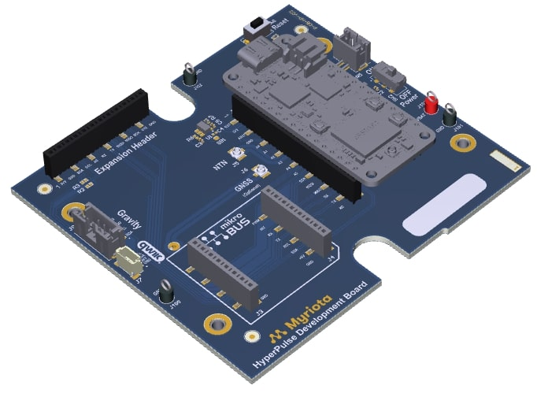
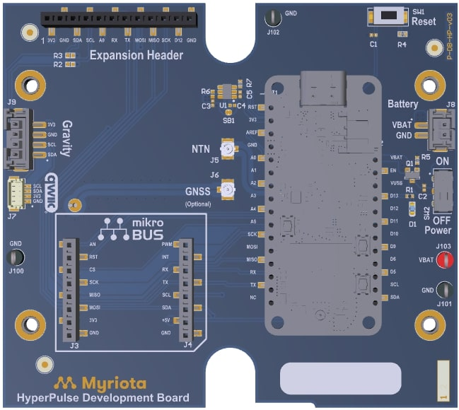
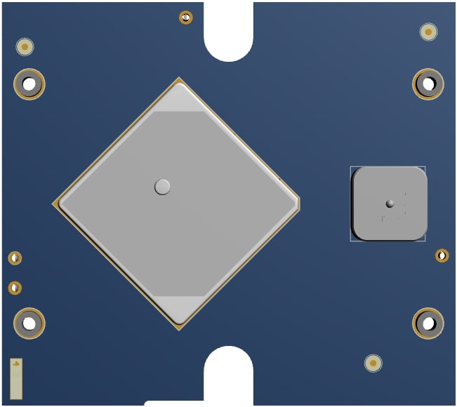

.. _hyperpulse_dk:

HyperPulse DK
#############

     HyperPulse Developer Kit (Myriota)

Overview
********

The **HyperPulse Developer Kit (DK)** is an expansion board designed to work
seamlessly with the `Circuit Dojo nRF9151 Feather <https://www.circuitdojo.com/products/nrf9151-feather>`__.
It extends the capabilities of the Feather platform by providing additional interfaces,
sensor expansion options, and power management features ideal for Myriota NTN
and GNSS-enabled applications.

The HyperPulse DK can be ordered from the
`Myriota website <https://myriota.com/hyperpulse-dev-kit/>`_.

The HyperPulse DK includes:

* Click board support (MikroBUS) for various sensors and peripherals
* Qwiic connector for I²C-based SparkFun Qwiic / Adafruit STEMMA QT modules
* Gravity connector for I²C DF Robot Gravity sensors
* On/Off slide switch
* Reset button
* Battery connector
* Expansion header exposing useful interfaces (Digital I/O, Analog Input, I2C, SPI, UART)
* Ports for NTN and GNSS antennas (antennas included)
* Mounting and mechanical support for the nRF9151 Feather board
* IP67-rated enclosure for dust and water protection

This makes the HyperPulse DK a flexible platform for prototyping sensor-rich
IoT and satellite-connected applications.

Hardware
********

Connections and IOs
===================

The HyperPulse DK exposes several interfaces and connectors to simplify
development:

MikroBUS Click Slot
-------------------

The HyperPulse DK includes a full **MikroBUS™ click slot**, allowing connection to
hundreds of plug-and-play click boards for rapid sensor and interface expansion.

This enables easy integration of peripherals such as:

* Temperature sensors  
* Motion sensors  
* GNSS modules  
* Air quality sensors  
* And many more

Gravity Connector
-----------------

The HyperPulse DK also exposes a **Gravity-series sensor connector**, allowing the
use of numerous plug-and-play modules from the DF Robot Gravity ecosystem.

Gravity sensors include:

* Analog sensors (light, soil moisture, temperature, etc.)  
* I2C digital sensors  
* Environmental modules  
* Simple UI components (buttons, LEDs, buzzers)  

Gravity connectors offer polarity-protected, beginner-friendly interfacing.

Qwiic Connector
---------------

A **Qwiic (SparkFun) connector** is provided for easy integration with the
Qwiic STEMMA-QT ecosystem of I2C sensors and peripherals.

Features include:

* 4-pin JST-SH I²C interface  
* Daisy-chainable modules  
* Wide range of supported sensors  
* No soldering required  

This makes it easy to prototype with I2C sensors such as temperature, IMU,
pressure, air-quality, and GNSS accessory modules.

Power and Control
-----------------

* **On/Off Switch** – Controls system power  
* **Reset Button** – Resets the nRF9151 Feather board
* **Battery Connector** – Standard 2-pin Li-ion/Li-Po input  

Antenna Ports
-------------

* **NTN Antenna Port** – Optimized for NTN satellite connectivity  
* **GNSS Antenna Port** – Suitable for both active and passive GNSS antennas  

Expansion Header
----------------

The DK provides an expansion header that exposes useful signals from the
nRF9151 Feather, including:

* Digital Input/Output
* Analog input
* I2C
* SPI  
* UART  
* Ground and supply rails  
