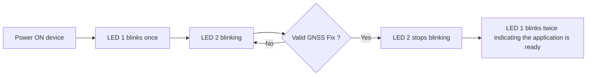

# Myriota HyperPulse Demo Application

The **Demo Application** is a reference implementation designed to demonstrate
**temperature, battery voltage, humidity, num and location reporting** over Myriota’s
**HyperPulse NTN (Non-Terrestrial Network)**.  

> [!IMPORTANT]
> This sample application is for `reference` use only they are not production ready.

## Key Features

- Temperature, battery voltage, humidity and num reporting
- GNSS-based location acquisition
- Configurable reporting interval (default: 24 messages per day)
- Shell interface for runtime configuration
- Persistent storage of settings in non-volatile memory

## Operation

The application uses the device’s onboard GNSS receiver to obtain its current
location, alongside the internal temperature, battery voltage, humidity and num field. These
values are then packaged into a message and scheduled for transmission. By
default, the application transmits **24 messages per day** (one per hour).  

Configuration parameters can be updated at runtime via the
**console shell interface**. All settings are saved in **non-volatile memory**,
ensuring they are preserved across device reboots.  

## App Configuration

The application provides runtime configuration through the
**console shell interface**. Settings are stored in non-volatile memory,
ensuring they persist across device restarts.

### Period

Controls how often the application generates and transmits a message via
satellite. The value is specified in **seconds**. By default, the period is set
to **3600 seconds** (1 hour).

- **Commands:**
  - `cfg period` – Print the current period value  
  - `cfg period <value>` – Set the period value  

### GNSS Fix

This setting controls whether the application attempts a new **GNSS fix** when
populating a user message.  

- If **enabled**, the device will attempt to acquire a fresh GNSS fix before sending each message.  
- If **disabled** (default), the application will use the **last known location** instead of performing a new fix.  

- **Commands:**
  - `cfg gnss_fix` – Display the current GNSS fix state (enabled/disabled)  
  - `cfg gnss_fix <1|0>` – Enable (`1`) or disable (`0`) GNSS fix attempts for user messages  

> [!IMPORTANT]  
> Acquiring GNSS fixes consumes significant energy.  
> Using frequent GNSS fixes (e.g., with a short reporting period) will **reduce battery life**.  

### Humidity Field Enable

Controls whether the humidity field is included in the message as a valid fixed
demo value.

- If **enabled**, the message includes a hardcoded humidity value (`65%`).
- If **disabled** (default), humidity is sent as an invalid sentinel value (`255`).

- **Commands:**
  - `cfg hum_enable` - Display humidity field state (enabled/disabled)
  - `cfg hum_enable <1|0>` - Enable (`1`) or disable (`0`) humidity field reporting

## Message Payload Format

| Bytes | Content | Type | Description |
| ----------- | ------- | ---- | ----------- |
| 0 - 3 | Sequence Number | uint32 | The sequence number of the message, i.e. message count. |
| 4 - 7 | Time | uint32 | The time of the location reading in [Unix time](https://en.wikipedia.org/wiki/Unix_time) format (also called Epoch time). |
| 8 - 11 | Latitude | int32 | The latitude of the device scaled by `1e7`. For example a received latitude value of `-891234567` is actually `-89.1234567`. |
| 12 - 15 | Longitude | int32 | The longitude of the device scaled by `1e7`. For example a received longitude value of `1386073300` is actually `138.6073300`. |
| 16 - 17 | Altitude | int16 | The elevation of the device in meters. |
| 18 | Temperature | int8_t | Internal temperature in degrees celsius. |
| 19 - 20 | Battery Voltage | uint16 | Battery voltage in milli-volts. |
| 21 | Humidity | uint8 | Humidity percent. Sent as `65` when enabled, or `255` when disabled. |
| 22 | Num | uint8 | Fixed hardcoded demo value: `15`. |

> [!IMPORTANT]
> Message data types are packed using little endian byte ordering.

## Visual indicators on start-up

When deploying the device, it is important to verify the expected start-up sequence.  
Observing the correct LED behavior ensures the device has initialized properly and is ready for operation in the field.  

> [!NOTE]
> The following table clarifies the LED assignments for different boards:
>
> | Board                    | LED1         | LED2         | Notes                               |
> | :----------------------- | :----------- | :----------- | :---------------------------------- |
> | Myriota HyperPulse DK    | Red LED      | Green LED    | Part of the RGB LED (nPM1300 chip)  |
